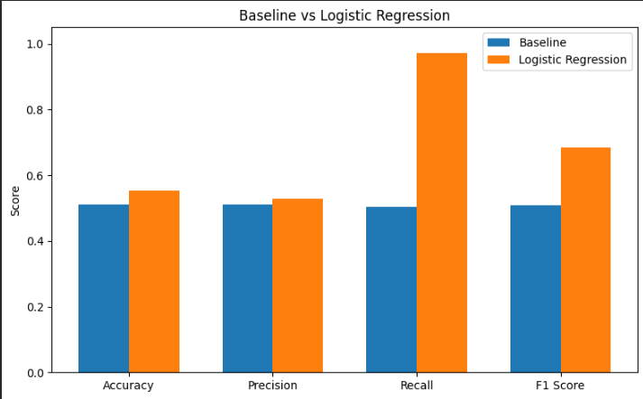
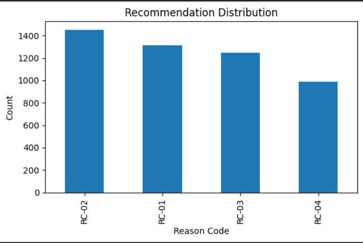

# Capstone Report — Content Refresh Prioritization

- **Author:** Gulam Mohd Khan
- **Lane:** Content Refresh Prioritization
- **Repo:** https://github.com/kratosontren/flyrank-ml-work
- **Date:** 30 JULY 2026

---

# 0. Abstract

This project investigates whether historical search performance signals can be used to prioritize content pages for manual review. The analysis uses anonymized historical Google Search Console data from the FlyRank ML Internship Warehouse. A transparent rule-based baseline was compared with a Logistic Regression model using historical search features and a proxy target derived from average search position. Performance was evaluated using both random and grouped validation strategies while explicitly checking for information leakage. The resulting ranked recommendations are intended as decision-support for SEO and content teams rather than proof that refreshing content will improve search performance.

---

# 1. Problem framing

## Decision Supported

The objective of this project is to help SEO analysts identify which pages should be reviewed first for potential content refresh.

## Unit of Analysis

One row represents one anonymized content page on one reporting date.

## Output

The system produces:

- A priority score
- A ranked recommendation queue
- A recommended editorial action

## Human Action

A content editor reviews the highest-ranked pages before deciding whether a refresh is necessary.

## Cost of Wrong Decisions

False positives increase editorial workload.

False negatives may delay review of pages that could potentially benefit from optimization.

## Why Machine Learning?

Historical search performance contains multiple interacting signals that are difficult to capture using simple threshold rules. Machine learning provides a consistent and data-driven method for prioritization while remaining interpretable.

---

# 2. Data safety

## Dataset

FlyRank ML Internship Warehouse

Primary table:

- fact_content_daily_performance

## Features Used

- gsc_impressions
- gsc_clicks

## Excluded

- Future outcome windows
- Label-derived variables
- trend_direction
- trend_pct
- Internal recommendation flags
- Client-identifying information

## Leakage Considerations

The feature used to define the proxy target (average search position) was excluded from model training.

Only historical information available before prediction time was retained.

No pseudonymous identifiers were used as model features.

No client-identifying information appears anywhere within the repository.

---

# 3. Baseline

A transparent rule-based baseline was created using historical search performance.

Pages with relatively high impressions and comparatively low click activity received higher priority scores.

The baseline provides an interpretable comparison against the Logistic Regression model using the same proxy target and evaluation methodology.

---

# 4. Model / Analysis

## Method

Logistic Regression

## Why this Method?

Logistic Regression was selected because it:

- is interpretable,
- provides a transparent baseline machine learning model,
- reduces overfitting risk compared with more complex models,
- allows coefficients to be interpreted directly.

## Features

- gsc_impressions
- gsc_clicks

## Excluded Features

- gsc_avg_position (used to construct the proxy target)
- Client identifiers
- Future observations
- Label-derived variables

## Target

Pages whose average search position exceeded the historical median were labelled as positive examples.

---

# 5. Evaluation

## Validation Design

Two evaluation strategies were used.

### Random Split

Standard 80/20 train-test split.

### Grouped Split

Grouped by client identifier.

Grouped validation better estimates generalization because observations from the same client cannot appear in both training and testing data.

## Performance

| Metric | Random Split | Grouped Split |
|---------|-------------:|--------------:|
| Accuracy | 0.552 | 0.349 |
| Precision | 0.528 | 0.335 |
| Recall | 0.972 | 0.982 |
| F1 Score | 0.685 | 0.500 |

### Performance Comparison

## Error Analysis

Grouped validation produced lower overall performance than the random split, suggesting that random evaluation overestimates performance.

The model achieved high recall but relatively lower precision, indicating that some pages are prioritized unnecessarily while most potentially relevant pages are identified.

# 6. Interpretation

Historical search impressions and click behaviour contain measurable information that supports prioritization decisions.

The grouped validation results indicate that generalization is substantially more difficult than random evaluation suggests.

No evidence was found that complex modelling is necessary for this development sample.

The results support the use of transparent decision-support systems rather than highly complex models.

---

# 7. Recommendation

The model produces a ranked content review queue.

## Reason Codes

RC-01 — Refresh Content

RC-02 — Improve CTR Elements

RC-03 — Monitor Performance

RC-04 — No Immediate Action

## Intended Use

Recommendations are intended to assist SEO analysts during manual content review.

### Recommendation Distribution

## Confidence

Confidence is moderate because recommendations are based solely on historical search behaviour and an experimental proxy target.

## Limits

Recommendations should never automatically publish, modify, redirect, or remove content.

Human editorial review remains essential.

---

# 8. Reproducibility

Repository

https://github.com/kratosontren/flyrank-ml-work

Main notebooks

- ML-04 Data Contract
- ML-05 Feature Vector
- ML-06 Signal Audit
- ML-07 Baseline Action Score
- ML-08 Capstone Modeling
- ML-09 Validation Audit
- ML-10 Action Playbook
- Capstone Notebook

Random seed

42

Environment

Python 3

pandas

numpy

scikit-learn

matplotlib

datasets

All notebooks can be executed from top to bottom using the provided repository.

---

# 9. Acknowledgments & Data Credit

Built on the **FlyRank ML Internship dataset**.

Data credit:

https://flyrank.ai

This work was completed as part of the FlyRank Machine Learning Internship using anonymized educational data for research and learning purposes.

---

## Claims Checklist

- Observed
- Measured
- Directional
- Decision-support

No causal claims are made.

No client-identifying information is included.

The reported methodology is reproducible from the public repository.
